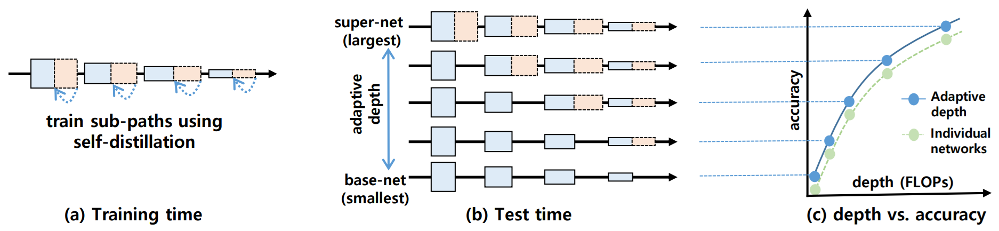

# Adaptive Depth Networks with Skippable Sub-Paths


This is the official implementation of [Adaptive Depth Networks with Skippable Sub-Paths (NeurIPS 2024)](https://arxiv.org/abs/2312.16392). 

* **A single network is trained** to have multiple skippable layers.
* At test time, the network's **depth can be scaled instantly** at no extra cost.  
* Depth-scaled networks **outperform** individually trained networks.
* Applicable both to **CNNs** and **Transformers** (ViT, Swin, etc.)


## Model Zoo
The depth, or FLOPs, can be controlled instantly using *--skip-cfg* option.

The layers in the *n*-th stage is skipped if *n*-th boolean value is *True*. 

Performance on ILSVRC-2012 validation set.
| Model          |*--skip-cfg* | GFLOPs  | Acc@1(%) |  Pretrained Weights                                                   |
|:--------------:|:-----------:|-----:|:-----|  ----------------------------------------------------------------------------------------------- |
| ResNet50-ADN   |FFFF         | 4.11  |77.6 (+0.9 %p) |  [Download](https://drive.google.com/file/d/1thbJDkDYhhM7ZI3LY8d9dZ4TWSbYMT0b/view?usp=sharing)  |
|                |TFFF         | 3.90  |77.1 |                                                                                                  |
|                |TTFF         | 3.46  |76.5 |                                                                                                  |
|                |TTTT         | 2.58  |76.1 (+1.1 %p)|                                                                                                  |
| ResNet50-ADN(v2)*   |FFFF         | 4.11  |80.5 |  [Download](https://drive.google.com/file/d/15g7GNB9VkTARW-yqyiHOyglfeOaGf15p/view?usp=drive_link)  |
|                |TFFF         | 3.90  |80.4 |                                                                                                  |
|                |TTFF         | 3.46  |79.9 |                                                                                                  |
|                |TTTF         | 2.80  |78.7 |                                                                                                  |
|                |TTTT         | 2.58  |78.4)|                                                                                                  |
| MobileNetV2-ADN|FFFFF        | 0.32  |72.5 (+0.4 %p)|  [Download](https://drive.google.com/file/d/1bft5SECYXOFjEhPSkAp2Z9d1U-7w2Mnz/view?usp=sharing) |
|                |TTTTT        | 0.22  |70.6 (+0.4 %p)|                                                                                                  |
| ViT-b/16-ADN   |FFFF         | 17.58 |81.4 (+0.3 %p) |  [Download](https://drive.google.com/file/d/1DlHNgjDCKJOWWFSuQIjClA5Ewbc6Jy3u/view?usp=sharing)  |
|                |FFFT         | 16.20 |81.2 |                                                                                                  |
|                |TTFF         | 14.67 |80.9 |                                                                                                  |
|                |TTFT         | 13.21 |80.7 |                                                                                                  |
|                |TTTT         | 11.76 |80.6 (+1.9 %p)|                                                                                                  |
| Swin-T-ADN     |FFFF         | 4.49  |81.6 (+0.1 %p) |  [Download](https://drive.google.com/file/d/10twk67rVBAoKFKZSkgsXEzx1RABX73kF/view?usp=sharing)  |
|                |TFFF         | 4.11  |80.8 |                                                                                                  |
|                |TTFF         | 3.75  |80.0 |                                                                                                  |
|                |TTTT         | 2.34  |78.0 (0.6 %p)|                                                                                                  |
* ResNet50-ADN(v2) is trained for 600 epochs according to [Pytorch's new training recipe](https://github.com/pytorch/vision/issues/3995#issuecomment-1013906621).
## Training and Evaluation on ImageNet
<details>
<summary>Requirements</summary>
 We conducted experiments under:
 <ul>
    <li>python 3.10</li>
    <li>pytorch 2.0, torchvision 0.15</li>
    <li>Cuda 12</li>
  </ul>
</details>
<details>
<summary>Data Preparation</summary>
Download ImageNet2012 train and val images from https://www.image-net.org.
 
We expect the directory structure to be the following:
```
path/to/imagenet2012/
  train/    # train images
  val/      # val images
```
</details>

<details>
<summary>Training</summary>

To train ResNet50-ADN on ILSVRC2012, run this command:
(Add '--fpn' to include intermediate features for self-distillation)

```
torchrun --nproc_per_node=4 train_adn.py --model resnet50 --batch-size 64 --lr-scheduler multisteplr --lr-multi-steps 60 100 140 --epochs 150 --norm-weight-decay 0 --bias-weight-decay 0 --subpath-temp 1.0 --output-dir <checkpoint directory> --data-path <ILSVRC2012 data path> 
```

To train ResNet50-ADN(v2) on ILSVRC2012, run this command:
(Add '--fpn' to include intermediate features for self-distillation)
torchrun --nproc_per_node=4 train_adn.py --model resnet50 --batch-size 256 --lr 0.5 --lr-scheduler cosineannealinglr --lr-warmup-epochs 5 --lr-warmup-method linear --auto-augment ta_wide --epochs 600 --random-erase 0.1 --weight-decay 0.00002 --norm-weight-decay 0.0 --mixup-alpha 0.2 --cutmix-alpha 1.0 --train-crop-size 176 --model-ema --val-resize-size 232 --ra-sampler --ra-reps=4 --bias-weight-decay 0 --amp --subpath-temp 1.0 --data-path <ILSVRC2012 data path>

To train Mobilenet-V2-ADN, run:

```train
torchrun --nproc_per_node=4 train_adn.py --model mobilenet_v2 --epochs 300 --lr 0.1 --wd 0.00001 --lr-scheduler multisteplr --lr-multi-steps 150 225 285 --batch-size 64 --norm-weight-decay 0 --bias-weight-decay 0 --subpath-temp 1.0 --output-dir <checkpoint directory> --data-path <ILSVRC2012 data path>
```

To train Swin-t-ADN, run:

```train
torchrun --nproc_per_node=4 train_adn.py --model swin_t --epochs 300 --batch-size 256 --opt adamw --lr 0.001 --weight-decay 0.05 --norm-weight-decay 0.0  --bias-weight-decay 0.0 --transformer-embedding-decay 0.0 --lr-scheduler cosineannealinglr --lr-min 0.00001 --lr-warmup-method linear  --lr-warmup-epochs 20 --lr-warmup-decay 0.01 --amp --label-smoothing 0.1 --mixup-alpha 0.8 --clip-grad-norm 5.0 --cutmix-alpha 1.0 --random-erase 0.25 --interpolation bicubic --auto-augment ta_wide --model-ema --ra-sampler --ra-reps 4  --val-resize-size 224 --subpath-temp 1.0 --output-dir <checkpoint directory> --data-path <ILSVRC2012 data path>
```

To train Vit-b-16-ADN, run:

```train
torchrun --nproc_per_node=4 train_adn.py --model vit_b_16 --epochs 300 --batch-size 256 --opt adamw --lr 0.00075 --wd 0.2 --lr-scheduler cosineannealinglr --lr-warmup-method linear --lr-warmup-epochs 30 --lr-warmup-decay 0.033 --amp --label-smoothing 0.11 --mixup-alpha 0.2 --auto-augment ra --clip-grad-norm 1 --ra-sampler --cutmix-alpha 1.0 --model-ema --subpath-temp 1.0 --output-dir <checkpoint directory> --data-path <ILSVRC2012 data path>
```
</details>

<details>
<summary>Evaluation</summary>

change *--skip-cfg* to select different sub-networks.

For example, use *'--skip-cfg True True True True'* to select the smallest sub-network.

To evaluate ResNet50-ADN, run:

```eval
python train_adn.py --model resnet50 --test-only --weights <weights file> --batch-size 256 --skip-cfg False False False False  --data-path <ILSVRC-2012 data path>
```

To evaluate ResNet50-ADN(v2), run:

```eval
 python train_adn.py --test-only --model resnet50 --batch-size 256 --val-resize-size 232 --weights <weights file> --skip-cfg True False False False --data-path <ILSVRC-2012 data path>
```


To evaluate MobileNetV2-ADN, run:

```eval
python train_adn.py --model mobilenet_v2 --test-only --weights <weights file> --batch-size 256 --skip-cfg False False False False False --data-path <ILSVRC-2012 data path>
```

To evaluate Swin-T-ADN, run:

```eval
python train_adn.py --model swin_t --test-only --weights <weights file> --batch-size 256 --skip-cfg False False False False --model-ema --interpolation bicubic --data-path <ILSVRC-2012 data path>
```

To evaluate Vit-b-16-ADN, run:

```eval
python train_adn.py --model vit_b_16 --test-only --weights <weights file> --batch-size 256 --skip-cfg False False False False --model-ema --data-path <ILSVRC-2012 data path>
```

</details>

## Citation

Please use the following BibTeX entries:

```
@inproceedings{kang2024adaptivedepth,
  title={Adaptive Depth Networks with Skippable Sub-Paths},
  author={Kang, Woochul and Lee, Hyungseop},
  booktitle={International Conference on Neural Information Processing (NeurIPS)},
  year={2024},
}
```
